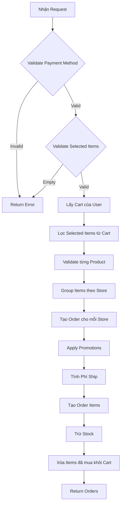

# 📦 Hướng Dẫn Thanh Toán (Checkout) - E-Commerce TechShop

## 📋 Tổng Quan

Hệ thống thanh toán cho phép người dùng:
- ✅ Chọn một hoặc nhiều sản phẩm trong giỏ hàng để thanh toán
- ✅ Áp dụng mã giảm giá cho đơn hàng và phí vận chuyển
- ✅ Hỗ trợ đơn hàng từ nhiều cửa hàng khác nhau
- ✅ Tự động tách đơn theo cửa hàng
- ✅ Tính toán phí vận chuyển và giảm giá

---

## 🔄 API Endpoint

```
POST /api/v1/buyer/orders/checkout
Authorization: Bearer {token}
Content-Type: application/json
```

---

## 📨 Request Body Structure

### 1. Request Body Đầy Đủ

```json
{
  "selected_items": [
    {
      "product_variant_id": "673a1b2c3d4e5f6789abcdef",
      "color_id": "red_001"
    },
    {
      "product_variant_id": "673b2c3d4e5f6789abcdef01",
      "color_id": null
    }
  ],
  "platform_promotions": {
    "order_promotion_code": "PLATFORM_SALE_10",
    "shipping_promotion_code": "PLATFORM_FREESHIP"
  },
  "store_promotions": {
    "store_id_1": {
      "order_promotion_code": "SALE50",
      "shipping_promotion_code": "FREESHIP"
    },
    "store_id_2": {
      "order_promotion_code": "NEWUSER20",
      "shipping_promotion_code": null
    }
  },
  "payment_method": "COD",
  "note": "Giao hàng buổi sáng",
  "address": {
    "province": "TP. Hồ Chí Minh",
    "ward": "Phường Bến Nghé",
    "home_address": "123 Nguyễn Huệ",
    "phone": "0901234567"
  }
}
```

### 2. Giải Thích Các Trường

| Trường | Kiểu | Bắt buộc | Mô tả |
|--------|------|----------|-------|
| `selected_items` | Array | ✅ Có | Danh sách sản phẩm được chọn để thanh toán |
| `selected_items[].product_variant_id` | String | ✅ Có | ID của product variant |
| `selected_items[].color_id` | String | ❌ Không | ID màu sắc (null nếu không có màu) |
| `platform_promotions` | Object | ❌ Không | Mã giảm giá của SÀN (áp dụng cho tất cả đơn hàng) |
| `platform_promotions.order_promotion_code` | String | ❌ Không | Mã giảm giá đơn hàng của sàn |
| `platform_promotions.shipping_promotion_code` | String | ❌ Không | Mã giảm phí vận chuyển của sàn |
| `store_promotions` | Object | ❌ Không | Mã giảm giá theo từng cửa hàng |
| `store_promotions[storeId].order_promotion_code` | String | ❌ Không | Mã giảm giá đơn hàng của cửa hàng |
| `store_promotions[storeId].shipping_promotion_code` | String | ❌ Không | Mã giảm phí vận chuyển của cửa hàng |
| `payment_method` | String | ✅ Có | Phương thức thanh toán |
| `note` | String | ❌ Không | Ghi chú cho đơn hàng |
| `address` | Object | ✅ Có | Địa chỉ giao hàng |

### 3. Phân Biệt Platform Promotion vs Store Promotion

| Loại | Issuer | ApplicableFor | Áp dụng cho | Ví dụ |
|------|--------|---------------|-------------|-------|
| **Platform Order** | `PLATFORM` | `ORDER` | **TẤT CẢ** đơn hàng | `PLATFORM_SALE_10` - Giảm 10% tất cả đơn |
| **Platform Shipping** | `PLATFORM` | `SHIPPING` | **TẤT CẢ** phí ship | `PLATFORM_FREESHIP` - Free ship tất cả đơn |
| **Store Order** | `STORE` | `ORDER` | **CHỈ** đơn hàng của store đó | `SALE50` - Giảm giá store A |
| **Store Shipping** | `STORE` | `SHIPPING` | **CHỈ** phí ship của store đó | `FREESHIP_A` - Free ship store A |

**Lưu ý quan trọng:**
- ✅ Platform promotion áp dụng cho **MỌI order** được tạo ra (từ mọi store)
- ✅ Store promotion chỉ áp dụng cho **order của store đó**
- ✅ Có thể kết hợp **CẢ HAI** loại promotion cùng lúc

### 4. Payment Methods Hỗ Trợ

- `COD` - Thanh toán khi nhận hàng
- `BANK_TRANSFER` - Chuyển khoản ngân hàng
- `CREDIT_CARD` - Thẻ tín dụng
- `E_WALLET` - Ví điện tử
- `VNPAY` - VNPay
- `MOMO` - MoMo

---

## 💡 Nghiệp Vụ Thanh Toán

### 1. Flow Xử Lý



### 2. Tách Đơn Theo Store

Hệ thống **tự động tách** thành nhiều đơn hàng nếu sản phẩm đến từ nhiều cửa hàng khác nhau:

**Ví dụ:**
```
Cart Items:
- Store A: Sản phẩm 1, 2
- Store B: Sản phẩm 3
- Store A: Sản phẩm 4

→ Tạo 2 Orders:
  - Order 1: Store A (Sản phẩm 1, 2, 4)
  - Order 2: Store B (Sản phẩm 3)
```

### 3. Tính Toán Giá

#### a. Tính Tổng Tiền Cho Mỗi Store

```
storeTotal = Σ (price × quantity) của các items thuộc store đó
```

#### b. Áp Dụng Mã Giảm Giá Đơn Hàng

```javascript
if (promotion.type === "PERCENTAGE") {
  orderDiscount = (storeTotal × discountValue) / 100
  // Áp dụng maxDiscountValue nếu có
  if (orderDiscount > maxDiscountValue) {
    orderDiscount = maxDiscountValue
  }
} else if (promotion.type === "FIXED_AMOUNT") {
  orderDiscount = discountValue
}
```

#### c. Tính Phí Vận Chuyển

```javascript
shippingFee = 30000  // VNĐ (mặc định)

if (shippingPromotion) {
  shippingDiscount = calculateDiscount(shippingFee, shippingPromotion)
  finalShippingFee = shippingFee - shippingDiscount
} else {
  finalShippingFee = shippingFee
}
```

#### d. Tổng Tiền Cuối Cùng

```
finalTotal = storeTotal - orderDiscount + finalShippingFee
```

**Ví dụ cụ thể:**
```
Tổng đơn hàng:      500,000 VNĐ
Giảm giá đơn (-):    50,000 VNĐ (SALE10 - 10%)
Phí ship (+):        30,000 VNĐ
Giảm phí ship (-):   30,000 VNĐ (FREESHIP)
-----------------------------------
TỔNG CỘNG:          450,000 VNĐ
```

---

## 🎫 Hệ Thống Promotion

### 1. Loại Mã Giảm Giá

| Loại | Áp dụng cho | Ví dụ |
|------|-------------|-------|
| **ORDER** | Đơn hàng | Giảm 10% đơn hàng, tối đa 50k |
| **SHIPPING** | Phí vận chuyển | Freeship, giảm 15k phí ship |

### 2. Kiểu Giảm Giá

| Kiểu | Mô tả | Ví dụ |
|------|-------|-------|
| **PERCENTAGE** | Giảm theo % | `discountValue: 10` = giảm 10% |
| **FIXED_AMOUNT** | Giảm cố định | `discountValue: 50000` = giảm 50k |

### 3. Điều Kiện Áp Dụng

Mã giảm giá được kiểm tra:

✅ **Status**: Phải `ACTIVE`
✅ **Thời gian**: Trong khoảng `startDate` - `endDate`
✅ **Giá trị đơn tối thiểu**: `orderTotal >= minOrderValue`
✅ **Số lần sử dụng**: `usedCount < usageLimit`
✅ **Issuer**: 
  - `STORE`: Chỉ áp dụng cho cửa hàng đó
  - `PLATFORM`: Áp dụng cho tất cả cửa hàng

### 4. Ví Dụ Áp Dụng Promotion

#### Case 1: Mã Giảm Giá Đơn Hàng

```json
{
  "store_promotions": {
    "store_abc_123": {
      "order_promotion_code": "SALE50",
      "shipping_promotion_code": null
    }
  }
}
```

**Promotion SALE50:**
- Type: `PERCENTAGE`
- DiscountValue: `10` (10%)
- MaxDiscountValue: `50000`
- MinOrderValue: `200000`
- ApplicableFor: `ORDER`

**Kết quả:**
```
Đơn hàng: 500,000 VNĐ
Giảm 10%: 50,000 VNĐ (đã áp dụng max)
Phí ship: 30,000 VNĐ
→ Tổng: 480,000 VNĐ
```

#### Case 2: Cả Mã Đơn Hàng + Freeship

```json
{
  "store_promotions": {
    "store_abc_123": {
      "order_promotion_code": "NEWUSER20",
      "shipping_promotion_code": "FREESHIP"
    }
  }
}
```

**Kết quả:**
```
Đơn hàng: 500,000 VNĐ
Giảm 20%: 100,000 VNĐ
Phí ship: 30,000 VNĐ
Freeship: -30,000 VNĐ
→ Tổng: 400,000 VNĐ
```

---

## 📦 Response Structure

### 1. Success Response (200 OK)

```json
{
  "success": true,
  "data": [
    {
      "id": "order_001",
      "buyer": { ... },
      "store": { ... },
      "total_price": 450000,
      "shipping_fee": 0,
      "payment_method": "COD",
      "status": "PENDING",
      "address": { ... },
      "order_items": [
        {
          "product_variant": { ... },
          "quantity": 2,
          "price": 200000,
          "color_id": "red_001"
        }
      ],
      "created_at": "2025-10-28T10:30:00"
    }
  ],
  "message": "Đặt hàng thành công"
}
```

### 2. Error Responses

#### Danh sách rỗng (400)
```json
{
  "success": false,
  "data": null,
  "message": "Vui lòng chọn ít nhất một sản phẩm để thanh toán"
}
```

#### Sản phẩm không tồn tại (404)
```json
{
  "success": false,
  "data": null,
  "message": "Không tìm thấy sản phẩm trong giỏ hàng: 673a1b2c... (màu: red_001)"
}
```

#### Không đủ hàng (400)
```json
{
  "success": false,
  "data": null,
  "message": "Không đủ hàng trong kho. Sản phẩm: iPhone 15 Pro (màu: Titan Xanh), Số lượng còn lại: 3"
}
```

#### Mã giảm giá không hợp lệ (400)
```json
{
  "success": false,
  "data": null,
  "message": "Mã giảm giá đơn hàng không hợp lệ hoặc không đủ điều kiện cho cửa hàng: TechStore"
}
```

---

## 🧪 Test Cases

### 1. Scenarios Cơ Bản

| # | Scenario | Expected Result |
|---|----------|-----------------|
| 1 | Checkout 1 sản phẩm không màu | ✅ Tạo 1 order thành công |
| 2 | Checkout 1 sản phẩm có màu | ✅ Tạo order với colorId |
| 3 | Checkout nhiều sản phẩm cùng store | ✅ Tạo 1 order |
| 4 | Checkout sản phẩm từ 2 stores | ✅ Tạo 2 orders riêng |
| 5 | Selected items rỗng | ❌ Error: "Vui lòng chọn..." |
| 6 | Product không trong cart | ❌ Error: "Không tìm thấy..." |
| 7 | Không đủ stock | ❌ Error: "Không đủ hàng..." |
| 8 | Store đã đóng | ❌ Error: "Cửa hàng tạm thời..." |

### 2. Test Promotion

| # | Scenario | Expected Result |
|---|----------|-----------------|
| 1 | Mã giảm giá hợp lệ | ✅ Áp dụng discount |
| 2 | Mã hết hạn | ❌ Error: validation failed |
| 3 | Đơn < minOrderValue | ❌ Error: validation failed |
| 4 | Mã đã hết lượt sử dụng | ❌ Error: validation failed |
| 5 | Mã store khác | ❌ Error: validation failed |
| 6 | Cả mã order + shipping | ✅ Áp dụng cả 2 |
| 7 | Mã PERCENTAGE > max | ✅ Chỉ giảm đến max |

### 3. Test Stock Management

| # | Scenario | Expected Result |
|---|----------|-----------------|
| 1 | Trừ stock sản phẩm không màu | ✅ Stock -= quantity |
| 2 | Trừ stock theo màu | ✅ ColorStock -= quantity, TotalStock recalc |
| 3 | Cancel order không màu | ✅ Stock += quantity |
| 4 | Cancel order có màu | ✅ ColorStock += quantity, TotalStock recalc |

---

## 📝 Example Requests

### Example 1: Đơn Giản (COD, Không Promotion)

```bash
curl -X POST "{{baseUrl}}/api/v1/buyer/orders/checkout" \
  -H "Authorization: Bearer {{token}}" \
  -H "Content-Type: application/json" \
  -d '{
    "selected_items": [
      {
        "product_variant_id": "673a1b2c3d4e5f6789abcdef",
        "color_id": null
      }
    ],
    "payment_method": "COD",
    "address": {
      "province": "Hà Nội",
      "ward": "Phường Cầu Giấy",
      "home_address": "456 Cầu Giấy",
      "phone": "0987654321"
    }
  }'
```

### Example 2: Nhiều Sản Phẩm + Promotion

```bash
curl -X POST "{{baseUrl}}/api/v1/buyer/orders/checkout" \
  -H "Authorization: Bearer {{token}}" \
  -H "Content-Type: application/json" \
  -d '{
    "selected_items": [
      {
        "product_variant_id": "prod_variant_1",
        "color_id": "color_red"
      },
      {
        "product_variant_id": "prod_variant_2",
        "color_id": "color_blue"
      },
      {
        "product_variant_id": "prod_variant_3",
        "color_id": null
      }
    ],
    "store_promotions": {
      "store_id_1": {
        "order_promotion_code": "SALE20",
        "shipping_promotion_code": "FREESHIP"
      }
    },
    "payment_method": "VNPAY",
    "note": "Giao nhanh giúp em",
    "address": {
      "province": "TP. Hồ Chí Minh",
      "ward": "Phường 1, Quận 1",
      "home_address": "789 Lê Lợi",
      "phone": "0912345678"
    }
  }'
```

### Example 3: Đa Store + Đa Promotion

```bash
curl -X POST "{{baseUrl}}/api/v1/buyer/orders/checkout" \
  -H "Authorization: Bearer {{token}}" \
  -H "Content-Type: application/json" \
  -d '{
    "selected_items": [
      {"product_variant_id": "prod_from_store_A", "color_id": null},
      {"product_variant_id": "prod_from_store_B", "color_id": "blue"}
    ],
    "store_promotions": {
      "store_A_id": {
        "order_promotion_code": "STOREAA10",
        "shipping_promotion_code": null
      },
      "store_B_id": {
        "order_promotion_code": null,
        "shipping_promotion_code": "FREESHIP_B"
      }
    },
    "payment_method": "MOMO",
    "address": {
      "province": "Đà Nẵng",
      "ward": "Phường Hòa Khánh",
      "home_address": "123 Nguyễn Văn Linh",
      "phone": "0905555555"
    }
  }'
```

### Example 4: Chỉ Áp Dụng Platform Promotion

```bash
curl -X POST "{{baseUrl}}/api/v1/buyer/orders/checkout" \
  -H "Authorization: Bearer {{token}}" \
  -H "Content-Type: application/json" \
  -d '{
    "selected_items": [
      {"product_variant_id": "prod_variant_1", "color_id": "red"}
    ],
    "platform_promotions": {
      "order_promotion_code": "PLATFORM_SALE_10",
      "shipping_promotion_code": "PLATFORM_FREESHIP"
    },
    "payment_method": "COD",
    "address": {
      "province": "Hà Nội",
      "ward": "Phường Láng Hạ",
      "home_address": "100 Láng Hạ",
      "phone": "0987654321"
    }
  }'
```

**Giải thích:**
- Mã `PLATFORM_SALE_10` sẽ giảm giá cho **TẤT CẢ** đơn hàng được tạo ra
- Mã `PLATFORM_FREESHIP` sẽ free ship cho **TẤT CẢ** đơn hàng
- Không có mã store promotion

### Example 5: Platform + Store Promotions (Full)

```bash
curl -X POST "{{baseUrl}}/api/v1/buyer/orders/checkout" \
  -H "Authorization: Bearer {{token}}" \
  -H "Content-Type: application/json" \
  -d '{
    "selected_items": [
      {"product_variant_id": "prod_from_store_A", "color_id": null},
      {"product_variant_id": "prod_from_store_B", "color_id": "blue"}
    ],
    "platform_promotions": {
      "order_promotion_code": "PLATFORM_SUMMER_15",
      "shipping_promotion_code": null
    },
    "store_promotions": {
      "store_A_id": {
        "order_promotion_code": "STORE_A_SALE_5",
        "shipping_promotion_code": "FREESHIP_A"
      }
    },
    "payment_method": "VNPAY",
    "address": {
      "province": "TP. Hồ Chí Minh",
      "ward": "Phường 1, Quận 1",
      "home_address": "500 Lê Lợi",
      "phone": "0912000000"
    }
  }'
```

**Giải thích:**
- **Platform ORDER**: `PLATFORM_SUMMER_15` giảm 15% → Áp dụng cho **CẢ 2 đơn hàng**
- **Store A ORDER**: `STORE_A_SALE_5` giảm 5% → Chỉ cho **đơn hàng Store A**
- **Store A SHIPPING**: `FREESHIP_A` → Free ship cho **đơn hàng Store A**
- **Đơn hàng Store B**: Chỉ có platform order promotion (15%)

**Kết quả tạo 2 orders:**

**Order 1 (Store A):**
```
Giá sản phẩm:        500,000 VNĐ
Platform giảm 15%:    -75,000 VNĐ (ORDER)
Store giảm 5%:        -21,250 VNĐ (ORDER - 5% của 425k)
Phí ship:             +30,000 VNĐ
Freeship Store A:     -30,000 VNĐ (SHIPPING)
━━━━━━━━━━━━━━━━━━━━━━━━━━━━━━━━━
TỔNG:                403,750 VNĐ
```

**Order 2 (Store B):**
```
Giá sản phẩm:        300,000 VNĐ
Platform giảm 15%:    -45,000 VNĐ (ORDER)
Phí ship:             +30,000 VNĐ
━━━━━━━━━━━━━━━━━━━━━━━━━━━━━━━━━
TỔNG:                285,000 VNĐ
```

### Example 6: Platform Freeship Cho Tất Cả

```bash
curl -X POST "{{baseUrl}}/api/v1/buyer/orders/checkout" \
  -H "Authorization: Bearer {{token}}" \
  -H "Content-Type: application/json" \
  -d '{
    "selected_items": [
      {"product_variant_id": "prod_from_store_A", "color_id": null},
      {"product_variant_id": "prod_from_store_B", "color_id": "red"},
      {"product_variant_id": "prod_from_store_C", "color_id": null}
    ],
    "platform_promotions": {
      "order_promotion_code": null,
      "shipping_promotion_code": "PLATFORM_FREESHIP_ALL"
    },
    "payment_method": "COD",
    "address": {
      "province": "Đà Nẵng",
      "ward": "Phường Hải Châu",
      "home_address": "50 Bạch Đằng",
      "phone": "0909999999"
    }
  }'
```

**Giải thích:**
- **Platform SHIPPING**: `PLATFORM_FREESHIP_ALL` → Free ship cho **TẤT CẢ 3 đơn hàng**
- Không có mã giảm giá đơn hàng

**Kết quả:**
```
Store A: 200k + 0đ ship = 200,000 VNĐ
Store B: 300k + 0đ ship = 300,000 VNĐ
Store C: 150k + 0đ ship = 150,000 VNĐ
━━━━━━━━━━━━━━━━━━━━━━━━━━━━━━━━━
TỔNG CỘNG:           650,000 VNĐ
```

---

## 🔍 Validation Rules

### 1. Selected Items

- ✅ Không được rỗng
- ✅ `product_variant_id` phải tồn tại
- ✅ Nếu có `color_id`, phải khớp với màu trong cart
- ✅ Sản phẩm phải có trong giỏ hàng của user

### 2. Payment Method

- ✅ Phải nằm trong danh sách: `[COD, BANK_TRANSFER, CREDIT_CARD, E_WALLET, VNPAY, MOMO]`

### 3. Platform Promotion Code

- ✅ Status = `ACTIVE`
- ✅ Issuer = `PLATFORM`
- ✅ Trong thời gian hiệu lực
- ✅ Đơn hàng >= `minOrderValue`
- ✅ Chưa hết lượt sử dụng
- ✅ ApplicableFor:
  - `ORDER`: Áp dụng cho giá trị đơn hàng của **TẤT CẢ** orders
  - `SHIPPING`: Áp dụng cho phí vận chuyển của **TẤT CẢ** orders

### 4. Store Promotion Codes

- ✅ Status = `ACTIVE`
- ✅ Issuer = `STORE` hoặc `PLATFORM`
- ✅ Trong thời gian hiệu lực
- ✅ Đơn hàng >= `minOrderValue`
- ✅ Chưa hết lượt sử dụng
- ✅ ApplicableFor:
  - `ORDER`: Áp dụng cho giá trị đơn hàng
  - `SHIPPING`: Áp dụng cho phí vận chuyển
- ✅ Nếu Issuer = `STORE`, phải đúng store

### 4. Address

- ✅ `province` không rỗng
- ✅ `ward` không rỗng
- ✅ `home_address` không rỗng
- ✅ `phone` không rỗng và đúng format

### 5. Stock

- ✅ Số lượng yêu cầu <= stock hiện có
- ✅ Nếu có màu sắc, kiểm tra stock của màu đó
- ✅ Store phải ở trạng thái `APPROVED`

---

## 📊 Order Status Flow

```
PENDING → CONFIRMED → SHIPPING → DELIVERED
   ↓
CANCELLED
```

| Status | Mô tả | Có thể chuyển sang |
|--------|-------|-------------------|
| **PENDING** | Chờ xác nhận | CONFIRMED, CANCELLED |
| **CONFIRMED** | Đã xác nhận | SHIPPING, CANCELLED |
| **SHIPPING** | Đang giao hàng | DELIVERED |
| **DELIVERED** | Đã giao hàng | (Kết thúc) |
| **CANCELLED** | Đã hủy | (Kết thúc) |

---

## 🚀 Frontend Implementation Guide

### 1. Lấy Danh Sách Sản Phẩm Được Chọn

```javascript
// React example
const selectedItems = cartItems
  .filter(item => item.isSelected)
  .map(item => ({
    product_variant_id: item.productVariant.id,
    color_id: item.selectedColor?.id || null
  }));
```

### 2. Xử Lý Promotion Input

```javascript
const [platformPromotions, setPlatformPromotions] = useState({
  orderPromotionCode: '',
  shippingPromotionCode: ''
});
const [storePromotions, setStorePromotions] = useState({});

// Áp dụng platform promotion
const applyPlatformPromotion = (type, code) => {
  setPlatformPromotions(prev => ({
    ...prev,
    [type === 'order' ? 'orderPromotionCode' : 'shippingPromotionCode']: code
  }));
};

// Thêm promotion cho một store
const addStorePromotion = (storeId, type, code) => {
  setStorePromotions(prev => ({
    ...prev,
    [storeId]: {
      ...prev[storeId],
      [type === 'order' ? 'order_promotion_code' : 'shipping_promotion_code']: code
    }
  }));
};
```

### 3. Submit Checkout

```javascript
const handleCheckout = async () => {
  try {
    // Chuẩn bị platform promotions (chỉ gửi nếu có ít nhất 1 mã)
    const hasPlatformPromotion = platformPromotions.orderPromotionCode || 
                                  platformPromotions.shippingPromotionCode;
    
    const response = await fetch('/api/v1/buyer/orders/checkout', {
      method: 'POST',
      headers: {
        'Authorization': `Bearer ${token}`,
        'Content-Type': 'application/json'
      },
      body: JSON.stringify({
        selected_items: selectedItems,
        platform_promotions: hasPlatformPromotion ? {
          order_promotion_code: platformPromotions.orderPromotionCode || null,
          shipping_promotion_code: platformPromotions.shippingPromotionCode || null
        } : undefined,
        store_promotions: storePromotions,
        payment_method: paymentMethod,
        note: note,
        address: address
      })
    });
    
    const data = await response.json();
    
    if (data.success) {
      // Redirect to order success page
      navigate('/orders/success', { state: { orders: data.data } });
    } else {
      // Show error
      alert(data.message);
    }
  } catch (error) {
    console.error('Checkout error:', error);
  }
};
```

---

## ⚙️ Backend Implementation Details

### 1. Các Class/Interface Chính

```
OrderService.java
  ├── checkout(User, OrderDTO) : List<Order>
  ├── isValidPaymentMethod(String) : boolean
  ├── isPromotionValid(Promotion, BigDecimal, Store) : boolean
  ├── calculateDiscount(BigDecimal, Promotion) : BigDecimal
  ├── getAvailableStock(ProductVariant, String) : int
  └── getProductPrice(ProductVariant, String) : Long

OrderDTO.java
  ├── selectedItems : List<SelectedCartItem>
  ├── storePromotions : Map<String, StorePromotions>
  ├── paymentMethod : String
  ├── note : String
  └── address : Address

SelectedCartItem.java
  ├── productVariantId : String
  └── colorId : String

StorePromotions.java
  ├── orderPromotionCode : String
  └── shippingPromotionCode : String
```

### 2. Database Collections

```
orders
  ├── _id
  ├── buyer (DBRef → users)
  ├── store (DBRef → stores)
  ├── total_price
  ├── shipping_fee
  ├── payment_method
  ├── status
  ├── address
  ├── promotion (DBRef → promotions)
  └── created_at

order_items
  ├── _id
  ├── order (DBRef → orders)
  ├── product_variant (DBRef → product_variants)
  ├── quantity
  ├── price
  └── color_id
```

---

## 🔐 Security Considerations

1. **Authentication**: Endpoint yêu cầu Bearer token hợp lệ
2. **Authorization**: User chỉ có thể checkout giỏ hàng của mình
3. **Validation**: Kiểm tra kỹ tất cả input từ client
4. **Stock Locking**: Sử dụng transaction để tránh overselling
5. **Promotion Abuse**: Kiểm tra usage limit và validate điều kiện

---

## 📅 Version History

| Version | Date | Changes |
|---------|------|---------|
| 2.0 | 2025-10-28 | Thêm shipping_fee vào Order entity |
| 1.5 | 2025-10-27 | Cập nhật promotion system (PLATFORM/STORE) |
| 1.0 | 2025-10-24 | Initial release với selected items |

---

## 📞 Support

Nếu có vấn đề, vui lòng liên hệ:
- **Email**: support@techshop.com
- **Slack**: #dev-ecommerce
- **Documentation**: https://docs.techshop.com/checkout

---

**Last Updated**: October 28, 2025

## Thay đổi

Trước đây, khi người dùng thanh toán, hệ thống sẽ tự động lấy **tất cả sản phẩm** trong giỏ hàng để tạo đơn hàng.

Sau cập nhật này, người dùng có thể **chọn một số sản phẩm cụ thể** trong giỏ hàng để thanh toán, thay vì phải thanh toán toàn bộ giỏ hàng.

## API Changes

### Request Body Mới

```json
POST /api/v1/buyer/orders/checkout
{
  "selected_items": [
    {
      "product_variant_id": "673a1b2c3d4e5f6789abcdef",
      "color_id": "673a1b310024789abcdef"  // null nếu sản phẩm không có màu
    },
    {
      "product_variant_id": "673b2c3d4e5f6789abcdef01",
      "color_id": null
    }
  ],
  "payment_method": "COD",
  "promotion_code": "SALE2024",
  "note": "Giao hàng buổi sáng",
  "address": {
    "province": "TP. Hồ Chí Minh",
    "ward": "Phường Bến Nghé",
    "home_address": "123 Nguyễn Huệ",
    "suggested_name": "Văn phòng"
  }
}
```

### Các Thay đổi Chi tiết

#### 1. OrderDTO.java
- **Thêm mới**: Trường `selectedItems` - Danh sách các sản phẩm được chọn để thanh toán
- **Thêm class**: `SelectedCartItem` - Định nghĩa cấu trúc của item được chọn
  - `productVariantId`: ID của product variant (bắt buộc)
  - `colorId`: ID của màu sắc (tùy chọn, null nếu sản phẩm không có màu)

#### 2. ICartService.java
- **Thêm phương thức mới**: `removeSelectedItems(User user, List<String> productVariantIds, List<String> colorIds)`
  - Xóa các sản phẩm đã được chọn và thanh toán khỏi giỏ hàng
  - Giữ lại các sản phẩm chưa được chọn trong giỏ hàng

#### 3. CartService.java
- **Implement**: `removeSelectedItems()` 
  - Duyệt qua danh sách sản phẩm được chọn
  - So sánh cả `productVariantId` và `colorId` để xác định chính xác item cần xóa
  - Lưu lại giỏ hàng sau khi xóa

#### 4. OrderService.java - checkout()
- **Bước 3**: Validate danh sách sản phẩm được chọn không rỗng
- **Bước 6**: Lọc ra các cart items được chọn từ giỏ hàng
  - So khớp theo `productVariantId` và `colorId`
  - Throw exception nếu không tìm thấy sản phẩm trong giỏ hàng
- **Bước 7**: Validate chỉ các sản phẩm được chọn
- **Bước 8**: Group chỉ các selected items theo store
- **Bước 8 (cuối)**: Xóa chỉ các sản phẩm đã thanh toán khỏi giỏ hàng (thay vì xóa toàn bộ)

#### 5. BuyerOrderController.java
- **Cập nhật**: Swagger documentation cho endpoint `/checkout`

## Ví dụ Sử dụng

### Case 1: Giỏ hàng có 5 sản phẩm, chọn 2 để thanh toán

**Giỏ hàng hiện tại:**
- Sản phẩm A (màu đỏ)
- Sản phẩm B (không có màu)
- Sản phẩm C (màu xanh)
- Sản phẩm D (màu vàng)
- Sản phẩm E (không có màu)

**Request:**
```json
{
  "selected_items": [
    {"product_variant_id": "A_id", "color_id": "red"},
    {"product_variant_id": "C_id", "color_id": "blue"}
  ],
  ...
}
```

**Kết quả:**
- Tạo đơn hàng cho sản phẩm A (màu đỏ) và C (màu xanh)
- Giỏ hàng còn lại: Sản phẩm B, D, E

### Case 2: Chọn tất cả sản phẩm

Client có thể gửi toàn bộ cart items trong `selected_items` để thanh toán hết giỏ hàng (giống nghiệp vụ cũ).

## Validation

1. **Danh sách selected_items không được rỗng**
   - Message: "Vui lòng chọn ít nhất một sản phẩm để thanh toán"

2. **Sản phẩm phải tồn tại trong giỏ hàng**
   - Message: "Không tìm thấy sản phẩm trong giỏ hàng: {productVariantId} (màu: {colorId})"

3. **Kiểm tra stock, store status như cũ**

## Breaking Changes

⚠️ **Lưu ý**: Đây là breaking change đối với API checkout

Các client cần cập nhật request body để bao gồm trường `selected_items`.

### Migration Guide cho Frontend

**Trước:**
```javascript
// Tự động lấy tất cả items trong cart
const checkoutData = {
  payment_method: "COD",
  address: {...}
}
```

**Sau:**
```javascript
// Phải chỉ định các items được chọn
const selectedItems = cartItems
  .filter(item => item.isSelected) // Lọc items được check
  .map(item => ({
    product_variant_id: item.productVariant.id,
    color_id: item.colorId
  }));

const checkoutData = {
  selected_items: selectedItems,
  payment_method: "COD",
  address: {...}
}
```

## Benefits

1. **UX tốt hơn**: Người dùng linh hoạt hơn trong việc quản lý đơn hàng
2. **Tránh lãng phí**: Không bắt buộc phải xóa sản phẩm khỏi giỏ để không mua
3. **Phù hợp với thực tế**: Giống các e-commerce platform khác (Shopee, Lazada, Tiki)
4. **Giữ lại wishlist**: Người dùng có thể giữ sản phẩm trong giỏ để mua sau

## Testing

### Test Cases cần kiểm tra:

1. ✅ Checkout với 1 sản phẩm được chọn
2. ✅ Checkout với nhiều sản phẩm từ cùng 1 store
3. ✅ Checkout với sản phẩm từ nhiều stores khác nhau
4. ✅ Checkout với sản phẩm có màu sắc
5. ✅ Checkout với sản phẩm không có màu sắc
6. ✅ Validation: Danh sách rỗng
7. ✅ Validation: Sản phẩm không tồn tại trong giỏ
8. ✅ Validation: colorId không khớp
9. ✅ Kiểm tra giỏ hàng sau checkout (chỉ xóa items đã mua)

### Postman Example Request

```json
POST {{baseUrl}}/api/v1/buyer/orders/checkout
Authorization: Bearer {{token}}

{
  "selected_items": [
    {
      "product_variant_id": "673a1b2c3d4e5f6789abcdef",
      "color_id": "red"
    }
  ],
  "payment_method": "COD",
  "address": {
    "province": "TP. Hồ Chí Minh",
    "ward": "Phường Bến Nghé",
    "home_address": "123 Nguyễn Huệ"
  }
}
```

## Timeline

- **Updated**: October 24, 2025
- **Affected Endpoints**: `POST /api/v1/buyer/orders/checkout`
- **Backward Compatible**: ❌ No (Breaking change)

